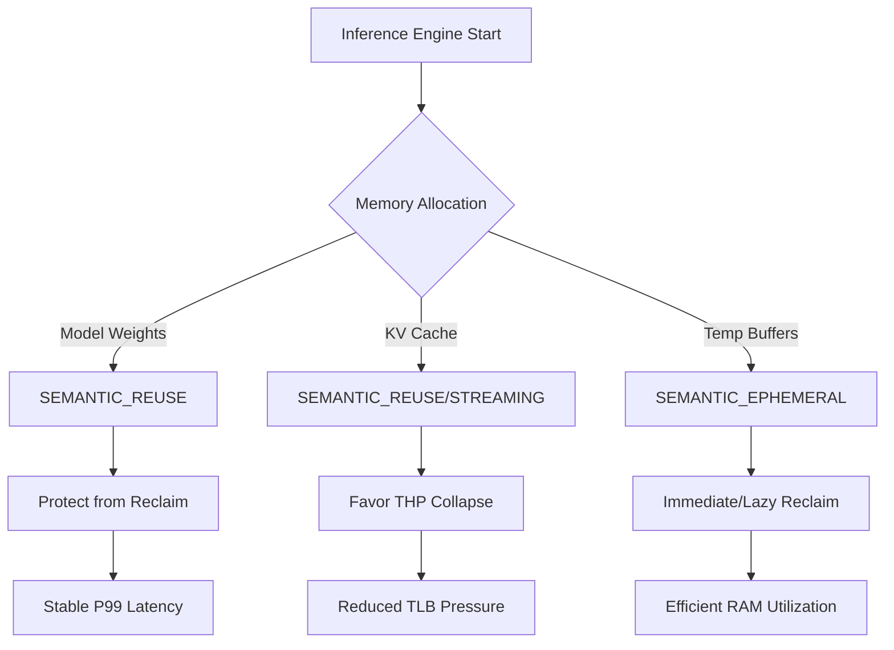
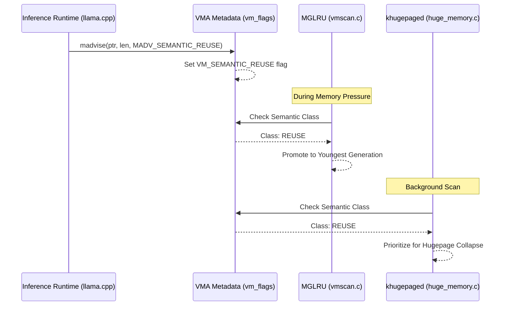

# Linux Inference Memory Hints

> **CRITICAL SAFETY NOTICE**: This project is for **LOCAL RESEARCH AND DEVELOPMENT ONLY**. 
> - **DO NOT** submit these patches to the Linux Kernel Mailing List (LKML).
> - **DO NOT** use `git send-email` with these files.
> - **DO NOT** contact kernel maintainers regarding this experimental prototype.

## Project Status
- **Upstream Status**: Not submitted. Research prototype only.
- **Stage**: Exploration / Prototyping / Benchmarking.

## Overview
`linux-inference-memory-hints` is a research project exploring the use of **semantic memory hints** to optimize Linux kernel memory management for large-scale AI inference workloads.

Traditional kernel memory management is reactive, relying on page access patterns to infer data "hotness." However, inference engines (e.g., llama.cpp, vLLM) have deterministic knowledge of their memory lifecycle. This project introduces three new `madvise` hints:
- `MADV_SEMANTIC_STREAMING`
- `MADV_SEMANTIC_REUSE`
- `MADV_SEMANTIC_EPHEMERAL`

By communicating intent, the kernel can proactively optimize for reclaim priority, THP (Transparent Huge Page) collapse, and NUMA placement.

## Architecture

### Memory Lifecycle and Semantic Classes


### Hint Flow Logic


## Repository Structure
- `patches/`: RFC (DO NOT SUBMIT) patchset for the Linux kernel.
- `benchmarks/`: Modified runtimes (llama.cpp, vLLM) and pressure test tools.
- `tools/`: Harness scripts for automated data collection and plotting.
- `docs/`: Technical design, draft RFC, and result templates.

## Benchmark Methodology
We evaluate the patchset using the following metrics:
1. **Inference Latency**: P50, P95, and P99 token latency under memory pressure.
2. **Reclaim Efficiency**: Ratio of `pgscan` to `pgsteal` in `/proc/vmstat`.
3. **Hugepage Success**: Rate of THP collapse for critical memory regions.
4. **PSI (Pressure Stall Information)**: Impact on system-wide memory pressure.

## Getting Started (Local Research Only)
1. **Apply Patches**: Apply the patches in `patches/` to a recent mainline kernel (e.g., v6.8+).
2. **Build Kernel**: Ensure `CONFIG_LRU_GEN` (MGLRU) and `CONFIG_TRANSPARENT_HUGEPAGE` are enabled.
3. **Run Benchmarks**:
   ```bash
   ./tools/run_llama_baseline.sh
   ./tools/run_llama_semantic.sh
   ```

## Why mm/?
We believe the Memory Management (`mm/`) subsystem is the optimal layer for these optimizations because:
- It provides a unified interface across different hardware (CPU, CXL, GPU-mapped memory).
- It leverages existing, robust mechanisms like MGLRU and khugepaged.

## License
MIT
